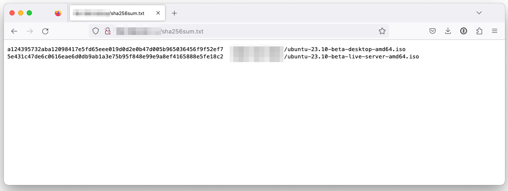

# Linux File Integrity Checker

## Description

A bash script that will run a md5, sha1sum, sha256sum, sha512sum on all files in a specified directory and then create a md5 sum file, sha1sum file, sha256sum file, sha512sum file and then creates an ordered list html file sorted alphabetically by file name

## Installation

It is helpful to have git installed to download all the related code for Linux File Integrity Checker.

### Requirements

Make sure to replace `/path/to/your/directory` with the actual path to the directory where you want to calculate the checksums.

## Usage

Once the software is downloaded or pulled via git:

 1. Change (`cd`) to the directory where the script is located (e.g., `cd script`)
 2. Make the backup script executable with the `chmod +x checksums.sh` command
 3. Run the command with `./checksums.sh`

## Guidelines

### Description: Questions to Consider

 * What is the app for?
   * Anyone who has multiple files that they need to collect integrity info on or wants to collect hash sum checks with a single command
 * What was your motivation?
   * Working on a gaming project called [Crossfire](https://sourceforge.net/projects/crossfire/), there is over 25 years of historical releases. Each release often contains two (2) to four (4) tar files. Very few of the .tar files have anything beyond md5 sums. To show and ensure the .tar files have not been altered, I wanted a way to report 
 * What problem does it solve?
   * Quickly provides file integrity info for a long list of files.

## Usage:

When you run this script, it will create the following files:

 1. `md5sum.txt`: Contains MD5 checksums for all files in the specified directory.
 
 2. `sha1sum.txt`: Contains SHA-1 checksums for all files in the specified directory.
 
 3. `sha256sum.txt`: Contains SHA-256 checksums for all files in the specified directory.
 
 4. `sha512sum.txt`: Contains SHA-512 checksums for all files in the specified directory.
 
 5. `checksums.html`: An HTML report that lists the files and their corresponding checksums sorted alphabetically by filename.
 

## Contributing

 * Contributions are welcome.
 * Pull requests are welcome.
 * Creating a fork on this code base is also welcome.

## Questions:

I can be reached via [tannerrj GitHub Profile](https://github.com/tannerrj)

## License:

MIT License
